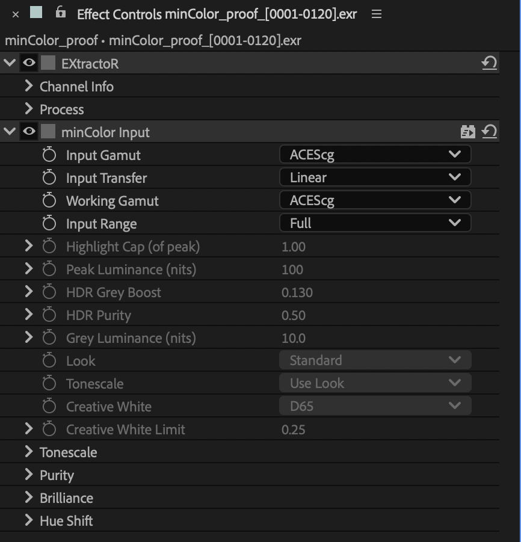
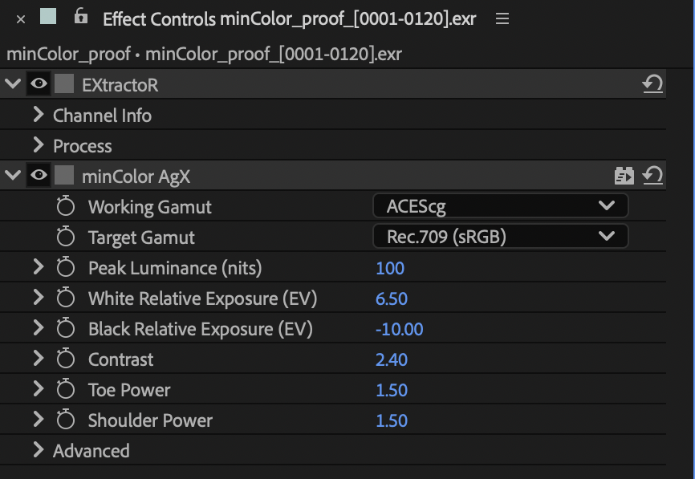
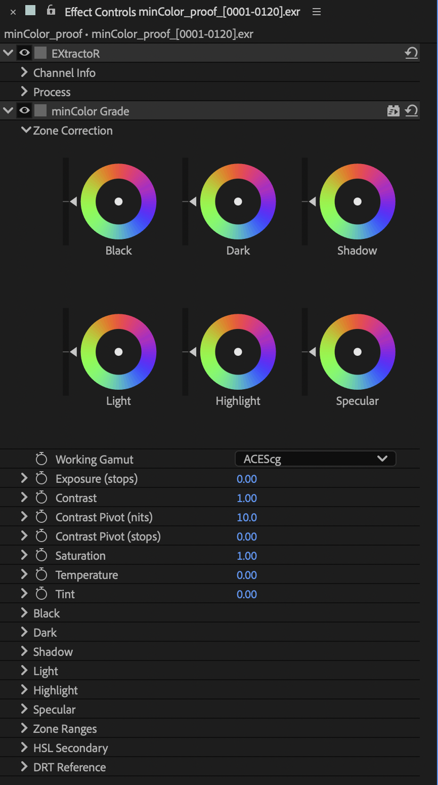

# minColorAE

Linear-light colour tools for Adobe After Effects: six effects and a small panel
that interpret footage into one working space, deliver through OpenColorIO, and
add a picture formation (OpenDRT or AgX) or a highlight knee only when you ask
for one.

**[Read the documentation →](docs/README.md)** ·
[Install](docs/install.md) · [Quick start](docs/quick-start.md)

<p>


</p>

*One frame of the proof footage (a Blender render in linear ACEScg, highlights to
55× diffuse white, spectral lasers outside ACEScg): un-tone-mapped, through
[minColor AgX](docs/effects/agx.md), and through the [OpenDRT rendering](docs/effects/output.md).*

<p>




</p>

*The panel, and minColor Input, AgX and Grade in Effect Controls.*

## What's in it

| | |
| --- | --- |
| **minColor Input** | What a file is (camera logs, display encodings, linear), into the comp's working space. |
| **minColor Output** | Encodes for a display or a delivery; un-tone-mapped, or an OpenDRT-derived rendering. |
| **minColor Grade** | Zone-based colour correction for linear light, with wheels and an HSL secondary. |
| **minColor Knee** | A BT.2390 highlight knee for HDR content heading somewhere dimmer. |
| **minColor AgX** | Parametric, HDR-capable AgX; Blender-compatible at its defaults. |
| **minColor macOS Fix** | Corrects After Effects' viewer on a Mac when not using OCIO. |
| **minColor panel** | Set OCIO, per-project In rules, Apply In, Add Output. |
| **OCIO config** | Linear conversions, generated from the same matrices as the effects. |

After Effects 2026 (26.5) on macOS (Metal) and Windows (CUDA), with CPU rendering
everywhere. Version 0.1.3.

## Credits and licensing

minColorAE is free software under the **GPL-3.0** ([LICENSE](LICENSE)).
Copyright (C) 2026 cbkow. It builds on others' work, credited in [NOTICE](NOTICE)
and [PROVENANCE.md](PROVENANCE.md):

- The rendering in minColor Output is derived from
  [OpenDRT](https://github.com/jedypod/open-display-transform) v1.1.0 by Jed Smith
  (GPL-3.0), modified; see [CHANGES-FROM-OPENDRT.md](CHANGES-FROM-OPENDRT.md).
  The unmodified DCTL is kept in `upstream/` as the test reference.
- minColor AgX ports parts of darktable's AgX module by István Kovács and the
  darktable developers (GPL-3.0-or-later); see [CHANGES-AGX.md](CHANGES-AGX.md).
  AgX is by Troy Sobotka; the Blender version, whose primaries and HDR method it
  follows, is by Eary Chow, Mark Faderbauer and Sakari Kapanen. No Blender files
  are included.
- The Knee follows ITU-R BT.2390.

minColorAE is not affiliated with or endorsed by OpenDRT, darktable, Blender,
Adobe or the Academy (ACES). After Effects is a trademark of Adobe. The Adobe
After Effects SDK is proprietary and is not part of this repository.

## Build

Needs Adobe's After Effects SDK (proprietary, obtained separately, never in this
repository): pass its path, or link it at `private/sdk/AfterEffectsSDK` (a symlink on
macOS, a directory junction on Windows: `mklink /J`).

```
cmake -S . -B build -DMINCOLOR_AE_SDK=/path/to/AfterEffectsSDK
cmake --build build
ctest --test-dir build --output-on-failure
cmake --build build --target install_ae
cmake --build build --target install_panel
cmake --build build --target install_presets
```

The plug-ins install to
`/Library/Application Support/Adobe/Common/Plug-ins/7.0/MediaCore/minColor/`, the
panel to `~/Library/Preferences/Adobe/After Effects/26.5/Scripts/ScriptUI Panels/`
(Window > minColor.jsx, dockable; AE reads that folder at launch), and the
animation presets to `~/Documents/Adobe/After Effects 2026/User Presets/minColor/`.

**Windows.** Visual Studio (2026 tested; its CMake and Ninja are used) and, for
the GPU path, the CUDA toolkit (13.4 tested; only the compiler and runtime
libraries are needed, not Nsight or the Visual Studio integration). Without the
toolkit the effects build CPU-only. From an *x64 Native Tools* prompt (or after
`vcvars64.bat`), elevated for `install_ae`:

```
cmake -S . -B build -G Ninja -DCMAKE_BUILD_TYPE=Release
cmake --build build
ctest --test-dir build --output-on-failure
cmake --build build --target install_ae install_panel install_presets
```

The effects (`.aex`) install to `C:\Program Files\Adobe\Common\Plug-ins\7.0\MediaCore\minColor\`,
the panel to `%APPDATA%\Adobe\After Effects\26.5\Scripts\ScriptUI Panels\`, and the
presets to `Documents\Adobe\After Effects 2026\User Presets\minColor\`. The CUDA kernels
are built for Turing and newer (PTX 7.5, SASS for Ampere, Ada and Blackwell). AE uses
them when the project's renderer is *Mercury GPU Acceleration (CUDA)*; under any other
renderer the effects render on the CPU, with the same results.

## Repository

```
core/       the colour maths, dialect-neutral (C++, Metal, CUDA)
ae/         the After Effects effects (one source, compiled per effect)
panel/      the ScriptUI panel
ocio/       mincolor.ocio (generated by tools/make_ocio) and mincolor-unmanaged.ocio
presets/    animation presets and the presets JSON
proof/      the Blender proof scene (scripted)
tools/      tests: the core against the upstream DCTL, the GPU kernels against the CPU
docs/       the user documentation
upstream/   OpenDRT v1.1.0, unmodified
```
