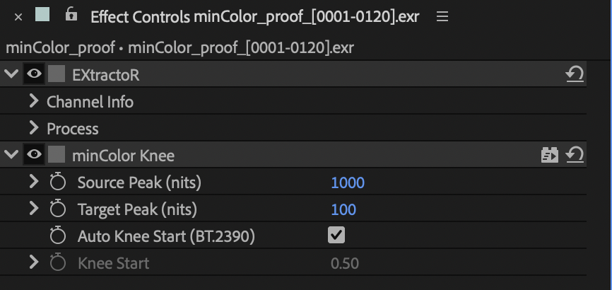

# minColor Knee

A highlight roll-off for linear light that is brighter than where it is going:
HDR footage, CG and comp work above 1.0, into an SDR view or delivery (Target
100) or an HDR one (Target its peak). Put it on an adjustment layer at the top of
the linear comp (under minColor Output, if there is one), or on single hot layers.
Linear in and out, 1.0 = 100 nits.

- **Source Peak (nits)**, default 1000: the brightest content that should still
  map; anything brighter lands on the target. Drags 100–4000, type up to 10000.
- **Target Peak (nits)**, default 100. Drags 48–1000, type up to 10000.
- **Auto Knee Start (BT.2390)**, on: the knee start and curve of ITU-R BT.2390,
  as QCView's Highlight Knee. For 1000 → 100 nits the knee begins near 28 nits
  and SDR white (100 nits) lands near 70.
- **Knee Start** (Auto off): where the knee begins, as a fraction of the target.
  For 1000 → 100 nits, 0.95 begins near 78 nits and puts SDR white near 89.

It works on the brightest channel and scales all three by the same amount, so
hues hold, and below the knee start it changes nothing at all. It has no gamut
setting: neutrals are the same in any working space.

Set **Source Peak** to the content: the proof footage peaks near 5500 nits, so at
the default 1000 most of its highlights still land at the target together. With
minColor AgX on, you do not need a knee: AgX already keeps everything under its
peak.
