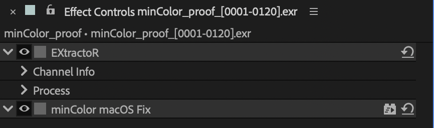

# minColor macOS Fix

No settings. Corrects how After Effects shows colour in its viewer on a Mac, for
projects that do not use OCIO (the Adobe engine).

After Effects' Mac viewer is a Display P3 surface decoded as a 2.2 power, so the
sRGB codes minColor Output writes look oversaturated there. The fix re-encodes
them for it: decode 2.2, Rec.709 to P3-D65, encode 2.2.

Put it on a **guide layer** (Layer > Guide Layer) at the very top of the comp,
above minColor Output. Guide layers show in the viewer but are skipped by the
Render Queue and Media Encoder; on an ordinary layer the fix would be baked into
the render.

In an OCIO project you don't need it: pick the **macOS (AE viewport fix)** display
instead (see [color setups](../color-setups.md#the-mac-viewer-and-why-there-is-a-fix)).
