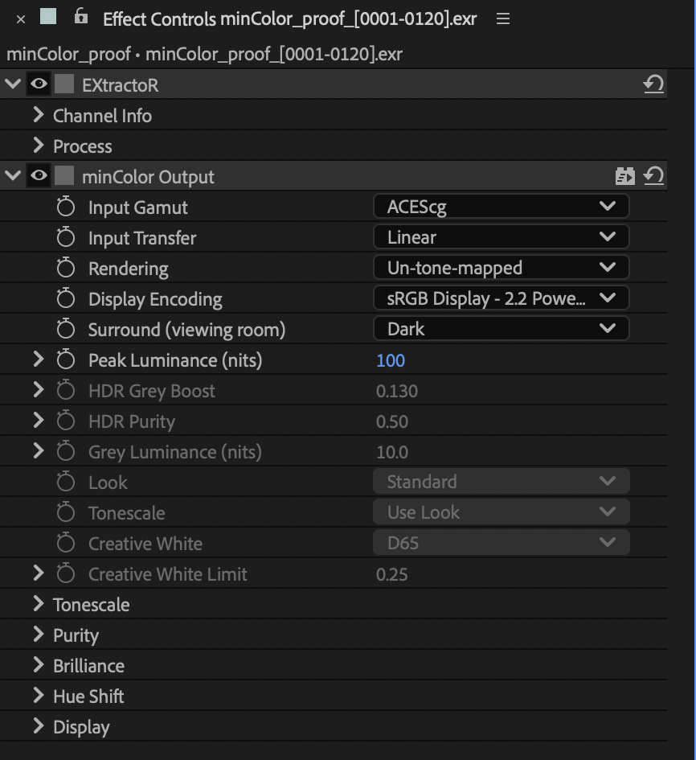

# minColor Output

Encodes the comp for a display or a delivery, optionally through a rendering
derived from OpenDRT. Put it on an adjustment layer at the top of the comp; the
panel's **Add Output** does this for you.

## How it is used

- **OCIO project**: Input Gamut = the working space, Display Encoding *None -
  Linear / Working Gamut*. The Output hands back linear light; the viewer's
  display and the Output Module encode it. Use it here only for the OpenDRT
  rendering.
- **Unmanaged or Adobe-engine project**: the Output's Display Encoding is the
  delivery's (sRGB, Rec.709, a linear hand-off…). What it writes is what renders.
  On a Mac, add [minColor macOS Fix](macos-fix.md) on a guide layer to correct the
  viewer.

## Controls

- **Input Gamut**, **Input Transfer**: what the comp contains (normally the
  working space, linear).
- **Rendering**: **Un-tone-mapped** (default) is a pure conversion, the gamut
  matrix and the display's curve: no tonescale, no clip, scene 1.0 at display
  white. A picture that came in through minColor Input leaves as itself. It
  matches the "Un-tone-mapped" view of After Effects' own ACES config to four
  decimals. **OpenDRT** renders the scene with the look rows below; they are
  greyed out under Un-tone-mapped.
- **Display Encoding**: sets Display Gamut, EOTF and Peak Luminance together.
  The display presets (sRGB Display 2.2, Rec.1886, Display P3, Rec.2100 PQ and
  HLG, DCI, Dolby PQ / P3-D65…) plus **None - Linear** in the working gamut,
  ACES 2065-1, ACEScg, Rec.2020 or Rec.709 for linear hand-offs. Default *sRGB
  Display - 2.2 Power / Rec.709*.
- **Surround (viewing room)**: Dark (default), Dim, Bright. Dim and Bright flatten
  the contrast a little for brighter rooms. No preset changes it.
- **Peak Luminance**, **HDR Grey Boost**, **HDR Purity**, **Grey Luminance**: for
  the OpenDRT rendering and HDR encodings.
- **Look**: Standard, Arriba, Sylvan, Colorful, Aery, Dystopic, Umbra, Base.
  Picking one writes every look parameter, including the tonescale.
- **Tonescale**: the tonescale presets, writing only the Tonescale group; *Use
  Look* puts the look's own tonescale back.
- **Creative White**, **Creative White Limit**.
- Collapsed groups: **Tonescale**, **Purity**, **Brilliance**, **Hue Shift**,
  **Display**. Editing a slider after picking a preset leaves the preset's name
  showing; the preset menus are commands, not states.

*The proof frame through the OpenDRT rendering (Standard look) in an OCIO project.*

The rendering is derived from [OpenDRT](https://github.com/jedypod/open-display-transform)
v1.1.0 by Jed Smith and modified for minColor; see
[CHANGES-FROM-OPENDRT.md](../../CHANGES-FROM-OPENDRT.md). minColor is not
affiliated with or endorsed by OpenDRT.
