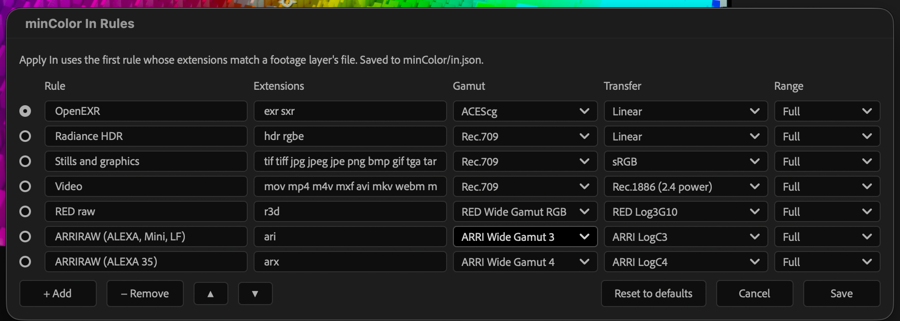

# The minColor panel

**Window > minColor.jsx**, dockable. The panel only sets things up: it adds and
configures effects and writes files next to your project. Nothing a frame renders
depends on it, and it never reads or reports colour settings on its own; each
button reports only what that press did, in the text under the buttons.

## Project

### Set OCIO

Asks for a working space, then:

1. sets the project's depth to **32 bpc** (8 and 16 bpc clip linear light at 1.0)
   and saves the project;
2. writes the config into `minColor/` next to the `.aep` (`mincolor.ocio`, or
   `mincolor-unmanaged.ocio` for *Unmanaged*);
3. makes it the project's OCIO config with that working space (OCIO on);
4. records the choice in `minColor/project.json`, which Apply In and Add Output
   follow;
5. reopens the project. Undo history is cleared, and a backup of the project
   from before the change is kept as `minColor/<name>.before-set-ocio.aep`.

After Effects has no scripting call that sets an OCIO working space, so the panel
writes it into the saved `.aep` and reopens it. It stores the config's path
absolutely: **after moving or copying a project, press Set OCIO again.** On an
Adobe-engine project, Set OCIO turns OCIO on, which changes how footage is
interpreted. When the working space changes, press Apply In again and check each
minColor Output's Input Gamut.

### In Rules…

The rules Apply In uses, for this project: which minColor Input settings each
file extension gets. The first rule that lists a layer's extension wins.

Edit the name, extensions (space separated) and Gamut / Transfer / Range (the
Input effect's own menus); add, remove and reorder rules; **Reset to defaults**
brings back the starter rules. **Save** writes `minColor/in.json`, which you can
also edit by hand.

The starter rules:

| Rule | Extensions | Gamut | Transfer |
| --- | --- | --- | --- |
| OpenEXR | exr sxr | ACEScg | Linear |
| Radiance HDR | hdr rgbe | Rec.709 | Linear |
| Stills and graphics | tif tiff jpg png psd ai pdf svg webp … | Rec.709 | sRGB |
| Video | mov mp4 mxf avi mkv … | Rec.709 | Rec.1886 (2.4 power) |
| RED raw | r3d | RED Wide Gamut RGB | RED Log3G10 |
| ARRIRAW (ALEXA, Mini, LF) | ari | ARRI Wide Gamut 3 | ARRI LogC3 |
| ARRIRAW (ALEXA 35) | arx | ARRI Wide Gamut 4 | ARRI LogC4 |

Range is *Full* throughout: After Effects already expands video levels when it
decodes. The raw rules assume After Effects' importer decodes R3D to Log3G10 and
ARRIRAW to the camera's LogC; change them if your importer settings differ.

## Layers

### Apply In

Sets **minColor Input** on the selected footage layers of the active comp from
the In rules, by file extension, and (in an OCIO project) sets its Working Gamut
to the project's working space. Layers without the effect get it first in their
effect stack. The panel lists the changes and asks before applying them; they
are one undo step. Every selected layer is reported, including the ones skipped
and why.

### Add Output

Adds an adjustment layer with **minColor Output** at the top of the active comp
(under a macOS Fix layer, if the comp has one). In an OCIO project it sets the
Input Gamut to the working space and the Display Encoding to *None - Linear /
Working Gamut*, so the Output hands back linear light for the viewer and the
Output Module to encode. One per comp: an existing one is reported instead.

## Requirements

Turn on **Preferences > Scripting & Expressions > Allow Scripts to Write Files and
Access Network**. Apply In and Add Output refuse to run when their effect is not
installed, rather than adding placeholders that do nothing.
