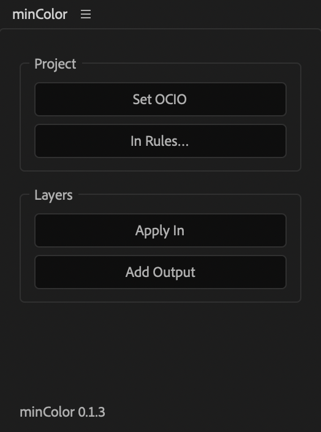
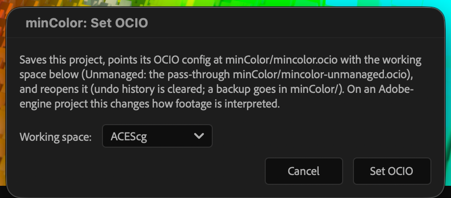
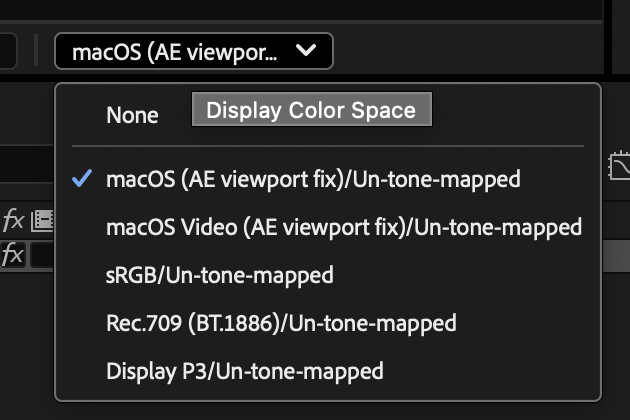
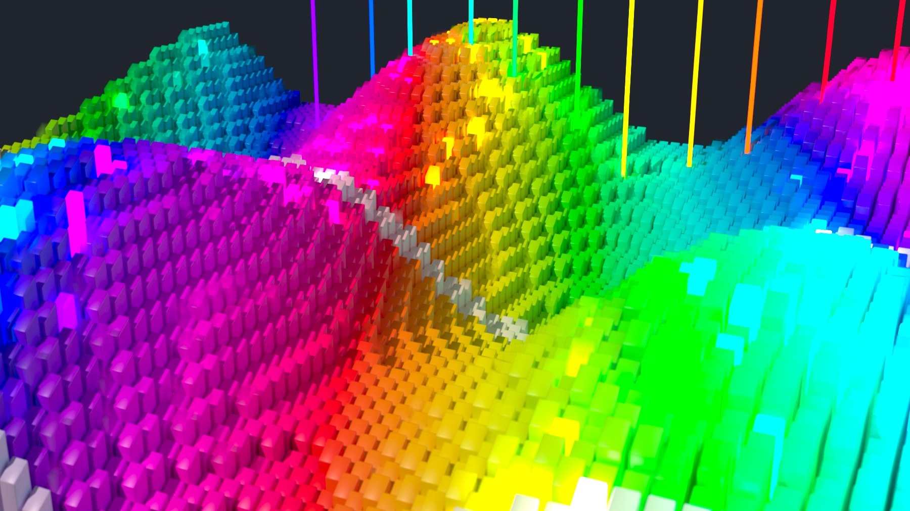
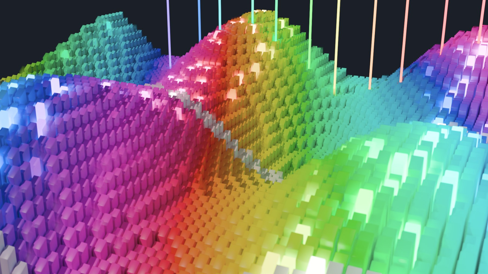
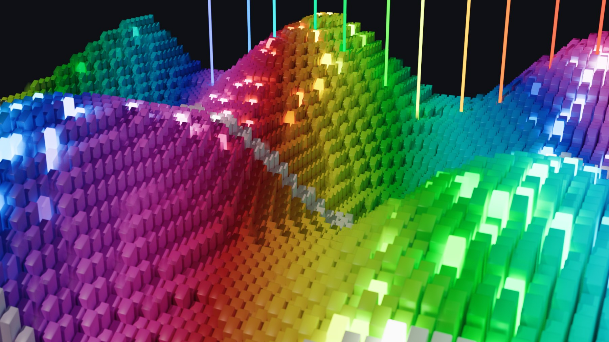

# Quick start

From an empty project to a render, in the setup most projects want: OpenColorIO
with a linear working space. [Color setups](color-setups.md) covers the
alternatives.

## 1. Save the project at 32 bpc

Create a project, set **File > Project Settings > Color > Depth** to **32 bits per
channel**, and save it. Set OCIO puts its files in a `minColor` folder next to the
`.aep`, so the project has to have a place on disk first.

## 2. Set OCIO

In the minColor panel, press **Set OCIO** and pick a working space. **ACEScg** is
the usual choice; Linear Rec.709, Linear P3-D65, Linear Rec.2020 and ACES2065-1
are there for pipelines that already use them.

 

The panel saves the project, writes `minColor/mincolor.ocio`, makes it the
project's OCIO config with that working space, and reopens the project. A backup
of the project as it was goes in `minColor/` too. Undo history is cleared by the
reopen.

## 3. Bring footage in with Apply In

Import your footage and put it in a comp. Select the footage layers and press
**Apply In**. Each layer gets **minColor Input**, set from its file extension:
EXR as ACEScg linear, stills and graphics as sRGB, video as Rec.709, R3D and
ARRIRAW as their camera logs. The panel shows what it will set before it does
anything, and the whole change is one undo step.

To change those assumptions for this project, press **In Rules…**. See
[the panel](panel.md#in-rules).

> **Multilayer EXRs** (Blender, Nuke): put EXtractoR (or After Effects' own
> channel extraction) on the layer first to pull out the beauty layer, then
> minColor Input after it.

## 4. Pick the viewer's display

At the bottom of the Composition panel, choose the display you are looking at:

| You are on | Choose |
| --- | --- |
| A Mac | **macOS (AE viewport fix)** |
| A Mac, checking a Rec.709 video deliverable as a Mac plays it | **macOS Video (AE viewport fix)** |
| Windows, an sRGB monitor | **sRGB** |
| Windows, a P3 monitor in P3 mode | **Display P3** |
| A Rec.709 reference monitor | **Rec.709 (BT.1886)** |

The choice is saved with the project. A freshly set-up project starts at *None*,
which shows the linear working space as raw numbers (dark and flat); After
Effects offers no way for a script to set it.

## 5. Shape the picture (optional)

So far the picture is *un-tone-mapped*: a linear conversion, where anything
brighter than display white clips. When you want highlights rolled off or a
filmic picture, add one of these on an adjustment layer at the top of the comp:

- [minColor Knee](effects/knee.md): touches only the highlights.
- [minColor AgX](effects/agx.md): Blender's AgX look, adjustable.
- [minColor Output](effects/output.md) with **Rendering: OpenDRT**: the OpenDRT
  look. The panel's **Add Output** sets it up for an OCIO project.

*Un-tone-mapped, AgX, OpenDRT: the same frame.*

## 6. Render

Add the comp to the Render Queue. In **Output Module Settings > Color**, set
**Output Color Space** to the delivery: **sRGB**, **Rec.709 BT.1886** or **Display
P3** for display-referred files, or a linear space (ACEScg, ACES2065-1…) for an
EXR hand-off. The macOS displays are for the viewer only and never appear there.
